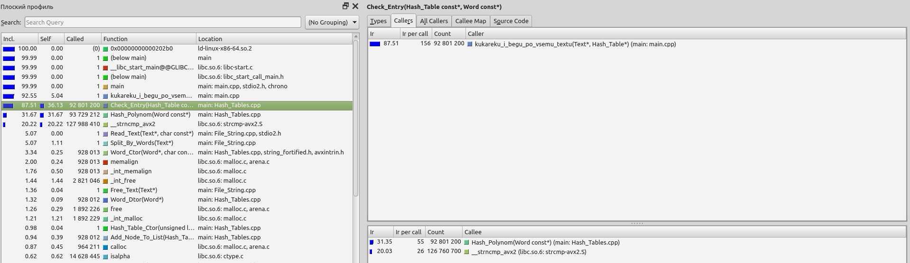
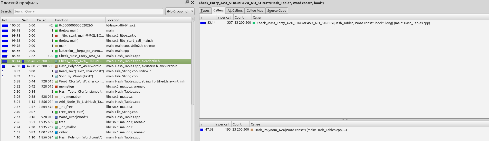

# Hash functions research and Hash table optimisation

## The goals:
- To implement a hash table
- To test several hash functions for distribution uniformity
- To research the hash table and implement at least 3 optimisations in different ways

## Tools
Laptop Honor Magicbook 15 with AMD Ryzen™ 5 5500U, Linux Mint x64 OS, callgrind, g++ compiler, NASM assembly.

## Theory reference
**Hash table** is a data structure. It stores all its elements as a pair of keys and values. The key is a unique number for value indexing. 
The hash table has several lists, in which data is stored. The list number is calculated with the **hash function**. It takes the key and returns the list number, in which we store the value.

If the hash function returns a number of already used list for a new value, **collision** occurs. Such situations can be handled in different ways. I used the chain method.
The idea of it is that elements with the same hash are stored in a linked list:

If we use a good hash function, it returns different list numbers for different keys, so data becomes distributed uniformly across the table. In this way, 
our hash table becomes a useful instrument to insert or find a value quickly. The first part of my work is exactly researching some different hash functions.

## Part 1. Hash functions research

To show the result in an understandable form, I will make graphs of the dependence of the amount of the collision on the list number for every analyzed function.

### 1. Returns 1
You can hardly ever imagine a hash function worse than this. It vanishes all the sense of hash tables. Was implemented only for educational purposes.
> Dispersion = 597962
~~~C++
long Hash_Just_One(const Word* word)
{
    return 1;
}
~~~

### 2. First-letter ASCII code
This function returns just the ASCII code of the first letter. Really bad function.
> Dispersion = 21777
~~~C++
long Hash_Ascii(const Word* word)
{
    return (long)word->word_text[0];
}
~~~

### 3. strlen
This hash function returns the length of the input word. An average English word has 5 letters, so the hash table also contains several lists with plenty of collisions and many empty lists.
> Dispersion = 79418
~~~C++
long Hash_Strlen(const Word* word)
{
    return word->word_len;
}
~~~

### 4. ASCII sum
This hash function returns the sum of the ASCII codes of every letter in the word. It's much better than previous ones, but its usability is limited. The function most commonly returns values from 400 to 1000, and these values are distributed not uniformly. 
> Dispersion = 710
~~~C++
long Hash_Ascii_Sum(const Word* word)
{
    long sum = 0;
    for (long i = 0; i < word->word_len; i++)
    {
        sum += (long) word->word_text[i];
    }

    return sum;
}
~~~

### 5. ROL
This hash function XORs current hash value, rotated left for 1 bit, with a current letter. This is pretty good.
> Dispersion = 51
~~~C++
long ROL(long num, int shift) {return (num << shift) | (num >> (sizeof(long) - shift));}
long Hash_Rol(const Word* word)
{
    long hash = 0;

    for (int i = 0; i < word->word_len; i++)
    {
        hash = ROL(hash, 1) ^ word->word_text[i];
    }

    return hash;
}
~~~

### 6. ROR
This function has the same algorithm as the previous one except for rotation right against left. Unexpectedly, there are some picks of the collision amounts, so this function is worse in our case than ROL.
> Dispersion = 115
~~~C++
long ROR(long num, int shift) {return (num >> shift) | (num << (sizeof(long) - shift));}
long Hash_Ror(const Word* word)
{
    long hash = 0;

    for (int i = 0; i < word->word_len; i++)
    {
        hash = ROR(hash, 1) ^ word->word_text[i];
    }

    return hash;
}
~~~

### 7. Polynom hash
This function multiplies the ASCII code of every word letter by the corresponding constant degree. So, $HASH_{n+1} = HASH_{n} + WordText_{n+1} \cdot k^{n+1}$
> Dispersion = 28
~~~C++
long Hash_Polynom(const Word* word)
{
    int k = 31;
    int pow_k = 1;
    long hash = 0;

    for (int i = 0; i < word->word_len; i++)
    {
        hash += ((long) word->word_text[i]) * pow_k;
        pow_k *= k;
    }

    return hash;
}
~~~
So, we see, in our case, we should use a polynom hash due to uniform distribution and low dispersion. In the next part of the work I will try to optimise the hash table for chosen function.

## Part 2. Optimisation of hash table

In this part of the work I will optimise the search function of the hash table. For this purpose, I will analyze which parts of the program use most of the computing resources and try to make these parts more efficient. 

I will use callgrind tool and KCachegrind to visualize got data to analyze the number of function calls in different parts of computations. 

To increase the time of search and to get comparable results I will search for all text words 100 times.

### Version 0. No optimisations

Let's look at the program's performance without any optimisations:

| Optimisation | Elapsed time (s)  | Absolute speeding up | Realative speeding up |
| :----------: | :---------------: | :------------------: | :-------------------: |
| Base verison |      11.1         |   1                  | 1                     |
| `-O3`        |      8.4          |   1.32               | 1.32                  |

In further measurements I will also use `-O3` compilation flag to get the maximum of my functions. Moreover, It's interesting to try to compete with a rather smart compiler and to see, how much can I do to make my program even more efficient than the standart `-O3` version.

Now let's look at callgrind's information: 

According to callgrind, the hash count function uses most of the computing resources. I will try to improve this function in differet ways.

 

 Standart search function realisation 

~~~C++
bool Check_Entry(const Hash_Table* table, const Word* word)
{
    long hash_list = ((*table->hash_function)(word))%table->hash_amount;
    Hash_Table_Node* node = table->heads[hash_list].nodes;
    bool entry = Check_List_Entry(node, table->heads[hash_list].list_length, word);

    return entry;
}

bool Check_List_Entry(Hash_Table_Node* node, const size_t list_length, const Word* word)
{
    bool entry = false;

    for (size_t i = 0; i < list_length; i++)
    {
        if (word->word_len == node->word->word_len)
        {
            if (strncmp(word->word_text, node->word->word_text, word->word_len) == 0)
            {
                entry = true;
                break;
            }
        }

        node = node->next_node;
    }

    return entry;
}

long Hash_Polynom(const Word* word)
{
    int k = 31;
    int pow_k = 1;
    long hash = 0;

    for (int i = 0; i < word->word_len; i++)
    {
        hash += ((long) word->word_text[i]) * pow_k;
        pow_k *= k;
    }

    return hash;
}

~~~

### Version 1.1 Hash count paralleling with AVX instructions
    
Firstly, I thought that hash could be computed for several words at the same time. So, I implemented the AVX version of the hash function. It gets 4 words at the same time and counts $WordText_{i} \cdot k^{i}$ for all taken words. I implemented several versions of that function, under the spoiler you can find the best one. It takes words as structures with text buffers of one common length, that is more or equal then the length of the longest word in the text. Such realisation is fast enough but implies more actions during parsing.
    

 

 Search function realisation with AVX 

~~~C++
void Check_Mass_Entry(Hash_Table* table, const Word* words, bool* entry, long amount)
{
    for (long i = 0; i < amount; i+=4)
    {
        Check_Entry_AVX(table, words + i, entry + i);
    }

    long i = (amount/4)*4;
    while (i < amount)
    {
        entry[i] = Check_Entry(table, &words[i]);
        i++;
    }
}
    
void Check_Entry_AVX(Hash_Table* table, const Word words[4], bool entry[4])
{
    __m256i avx_hashes = Hash_Polynom_AVX(words);
    long long* hashes = (long long*) &avx_hashes;
    for (int i = 0; i < 4; i++)
    {
        hashes[i] = ((long long*) &avx_hashes)[i];
    }

    for (long j = 0; j < 4; j++)
    {
        long hash_list = hashes[j]%table->hash_amount;
        Hash_Table_Node* node = table->heads[hash_list].nodes;
        entry[j] = Check_List_Entry(node, table->heads[hash_list].list_length, &words[j]);
    }
}
    
__m256i Hash_Polynom_AVX(const Word* words)
{
    __m256i pow_k = _mm256_set1_epi64x(1);
    const __m256i k = _mm256_set1_epi64x((long)31);
    __m256i hashes = _mm256_set1_epi64x(0);
    const __m256i just_ones = _mm256_set1_epi64x(1);
    __m256i letters = _mm256_set_epi64x(words[3].word_text[0], words[2].word_text[0], words[1].word_text[0], words[0].word_text[0]);

    long max_len = 0;
    for (int j = 0; j < 4; j ++)
    {
        if (words[j].word_len > max_len) max_len = words[j].word_len;
    }

    for (int j = 0; j < max_len; j ++)
    {
        __m256i cur_letter_term = _mm256_mul_epi32(pow_k, letters);
        hashes = _mm256_add_epi64(hashes, cur_letter_term);
        pow_k = _mm256_mul_epi32(pow_k, k);

        letters = _mm256_set_epi64x(words[3].word_text[j+1], words[2].word_text[j+1], words[1].word_text[j+1], words[0].word_text[j+1]);
    }

    return hashes;
}
                                

bool Check_List_Entry(Hash_Table_Node* node, const size_t list_length, const Word* word)
{
    bool entry = false;

    for (size_t i = 0; i < list_length; i++)
    {
        if (word->word_len == node->word->word_len)
        {
            if (strncmp(word->word_text, node->word->word_text, word->word_len) == 0)
            {
                entry = true;
                break;
            }
        }

        node = node->next_node;
    }

    return entry;
}
    

~~~
    

    
    
| Optimisation | Elapsed time (s)  | Absolute speeding up | Realative speeding up |
| :----------: | :---------------: | :------------------: | :-------------------: |
| Base verison |      11.1         |   1                  | 1                     |
| `-O3`        |      8.4          |   1.32               | 1.32                  |
| AVX hash     |      8.1          |   1.37               | 1.04                  |
    
We see, our optimisation improves the performance, but not 4 times. It happened due to plenty of memory references. Unfortunately, it was difficult for me to implement such an algorithm that needs only one load from memory.
    

### Version 1.2 Hash count using AVX instruction for a single word
    
After previous optimisation I also thought to try to count 4 products of $WordText_{i} \cdot k^{i}$, but for one word for 4 letters in one time. You can find the implementation under the spoiler
    

 

 Hash function realisation with AVX for 1 word 

    
~~~C++
long Hash_Polynom_AVX_one_word(const Word* word)
{
    long k = 31;
    long cur_pow = 1;
    alignas(32) long pow_k[4] = {};
    __m256i hashes = _mm256_set1_epi64x(0);
    long hash = 0;

    for (int i = 0; i < word->word_len; i+=4)
    {
        for (int j = 0; j < 4; j++)
        {
            pow_k[j] = cur_pow;
            cur_pow *= k;
        }

        __m256i avx_pow = _mm256_load_si256((__m256i*)pow_k);
        __m128i letters_loaded = _mm_load_si128((__m128i*)((char*)word->avx_text) + i);
        __m256i letters = _mm256_cvtepi8_epi64(letters_loaded);
        __m256i hash_mass_avx = _mm256_mul_epi32(letters, avx_pow);
        hashes = _mm256_add_epi64(hash_mass_avx, hashes);
    }

    long long* hash_mass = (long long*) &hashes;
    for (int j = 0; j < 4; j++) hash+=hash_mass[j];

    return hash;
}
~~~

    
| Optimisation   | Elapsed time (s)  | Absolute speeding up | Realative speeding up |
| :------------: | :---------------: | :------------------: | :-------------------: |
| Base verison   |      11.1         |   1                  | 1                     |
| `-O3`          |      8.4          |   1.32               | 1.32                  |
| AVX hash       |      8.1          |   1.37               | 1.04                  |
| AVX hash 1 word|      8.4          |   1.32               | 0.96                  |
    
We see this optimisation has no effect. But it at least doesn't slow down the program.
    
### Version 1.3 Hash count. ASM realisation
    
After a previous try, I decided to implement an assembler version of the hash function. You can see it under the spoiler
    

 

 Hash function realisation with ASM 

    
~~~asm
Asm_Hash_Polynom: 

    push rdi
    push rsi
    push rbx
    push rcx
    push r8
    push r9
    push r10

    mov rsi, [rdi]
    mov rbx, 0
    mov bl, byte [rsi]  
    inc rsi

    mov rcx, qword [rdi+8]   
    ;dec rcx

    mov r9, 31          
    mov r8, 1            

    mov r10, 0           

    cmp rcx, 1
    jb .no_need

    xor rdx, rdx
  .zaloopa:
    mov rax, r8
    imul ebx             
    rol rdx, 32
    add rax, rdx         
    xor rdx, rdx
    
    add r10, rax         
    xor rax, rax
    
    mov rax, r8
    mov rbx, r9
    imul ebx             
    xor rdx, rdx
    mov r8, rax         

    xor rbx, rbx
    mov bl, byte [rsi]
    inc rsi

    loop .zaloopa

  .no_need:
    mov rax, r10

    pop r10
    pop r9
    pop r8
    pop rcx 
    pop rbx
    pop rsi
    pop rdi
    ret
~~~
    

 
    
| Optimisation   | Elapsed time (s)  | Absolute speeding up | Realative speeding up |
| :------------: | :---------------: | :------------------: | :-------------------: |
| Base verison   |      11.1         |   1                  | 1                     |
| `-O3`          |      8.4          |   1.32               | 1.32                  |
| AVX hash       |      8.1          |   1.37               | 1.04                  |
| AVX hash 1 word|      8.4          |   1.32               | 0.96                  |
| ASM hash       |      8.8          |   1.26               | 0.95                  |
    
We see, rewriting the hash function on assembly makes the performance even worse than `-O3` standard version. 
    
### Version 2. Optimising strcmp
    
The second "narrow neck" of the program is strcmp. I will try to improve an already improved by compiler version of strcmp
    

 

 strcmp improve. First try 

    
~~~C++
    
void Check_Entry_AVX_STRCMPAVX(Hash_Table* table, const Word words[4], bool entry[4])
{
    __m256i avx_hashes = Hash_Polynom_AVX(words);
    long long* hashes = (long long*) &avx_hashes;
    for (int i = 0; i < 4; i++)
    {
        hashes[i] = ((long long*) &avx_hashes)[i];
    }

    for (long j = 0; j < 4; j++)
    {
        long hash_list = hashes[j]%table->hash_amount;
        Hash_Table_Node* node = table->heads[hash_list].nodes;

        alignas(32) char word_text[32] = "";
        strncpy(word_text, words[j].word_text, words[j].word_len);

        __m256i text_to_find = _mm256_load_si256((__m256i*)word_text);

        
        for (size_t i = 0; i < table->heads[hash_list].list_length; i++)
        {
            alignas(32) char text_to_check[32] = "";
            strncpy(text_to_check, node->word->word_text, node->word->word_len);
            __m256i node_text = _mm256_load_si256((__m256i*)text_to_check);
            __m256i cmp = _mm256_cmpeq_epi8(text_to_find, node_text);
            int cmp_mask = (int) _mm256_movemask_epi8(cmp);
            if (cmp_mask == -1) 
            {
                entry[j] = true;
                break; 
            }

            node = node->next_node;
        }
    }
}

~~~

 
    
    
| Optimisation   | Elapsed time (s)  | Absolute speeding up | Realative speeding up |
| :------------: | :---------------: | :------------------: | :-------------------: |
| Base verison   |      11.1         |   1                  | 1                     |
| `-O3`          |      8.4          |   1.32               | 1.32                  |
| AVX hash       |      8.1          |   1.37               | 1.04                  |
| AVX hash 1 word|      8.4          |   1.32               | 0.96                  |
| ASM hash       |      8.8          |   1.26               | 0.95                  |
| AVX + strcmp   |      11.7         |   0.95               | 0.75                  |
    
It's hard to even name it "optimisation". Although it was easy to understand that replacing strcmp with strcpy and a variety of other instructions is not a perfect idea.
    
We can notice that all the words in the text have a length of not more than 20 letters. So, every word can be wholly loaded to AVX variables during parsing. In that case, we can avoid long loadings from memory.
    

 

 strcmp improve. Second try 

    
~~~C++
bool Check_List_Entry_AVX(Hash_Table_Node* node, const size_t list_length, const Word* word)
{
    __m256i text_to_find = *word->avx_text;
    bool entry = false;

    for (size_t i = 0; i < list_length; i++)
    {
        __m256i node_text = *node->word->avx_text;
        __m256i cmp = _mm256_cmpeq_epi8(text_to_find, node_text);
        int cmp_mask = (int) _mm256_movemask_epi8(cmp);
        if (cmp_mask == -1) 
        {
            entry = true;
            break; 
        }

        node = node->next_node;
    }

    return entry;
}

void Check_Entry_AVX_STRCMPAVX_NO_STRCPY(Hash_Table* table, const Word words[4], bool entry[4])
{
    __m256i avx_hashes = Hash_Polynom_AVX(words);
    long long* hashes = (long long*) &avx_hashes;
    for (int i = 0; i < 4; i++)
    {
        hashes[i] = ((long long*) &avx_hashes)[i];
    }

    for (long j = 0; j < 4; j++)
    {
        long hash_list = hashes[j]%table->hash_amount;
        Hash_Table_Node* node = table->heads[hash_list].nodes;

        entry[j] = Check_List_Entry_AVX(node, table->heads[hash_list].list_length, &words[j]);
    }
}
~~~
    

 

| Optimisation          | Elapsed time (s)  | Absolute speeding up | Realative speeding up |
| :-------------------: | :---------------: | :------------------: | :-------------------: |
| Base verison          |      11.1         |   1                  | 1                     |
| `-O3`                 |      8.4          |   1.32               | 1.32                  |
| AVX hash              |      8.1          |   1.37               | 1.04                  |
| AVX hash 1 word       |      8.4          |   1.32               | 0.96                  |
| ASM hash              |      8.8          |   1.26               | 0.95                  |
| AVX + strcmp          |      11.7         |   0.95               | 0.75                  |
| AVX + strcmp no load  |      7.7          |   1.44               | 1.52                  |
    
This optimisation definitely reached the result. 
    
### Intermediate conclusion
    
I optimised two functions using most of the computing resources and improved performance by 44% compared to the base version and 9% compared to the base version compiled with `-O3` flag. 
    
Now I will try to make some cheat optimisations.

### Version 3. Changing hash function.

I tried to improve the performance of the polynom hash function. It had some effect, but it also has a sence to use the hash function, which can be called from the assembly directly. This is CRC32. I will not describe its method of work, you can read about it [here](https://en.wikipedia.org/wiki/Cyclic_redundancy_check#CRCs_and_data_integrity). Its main advantage is the ability to call it directly from the assembly. Certainly, the hash table needs to be rebuilt with the use of this function.

So we can create the hash function with inline assembly:

 

 CRC32 

~~~C++

long CRC32_Hash(const Word* word)
{
    long hash = 0;
    const char* text = word->word_text;
    asm(
        R"(
            .intel_syntax noprefix
            xor rax, rax
            crc32q rax, qword ptr [%1 + 0x00]
            crc32q rax, qword ptr [%1 + 0x08]
            crc32q rax, qword ptr [%1 + 0x10]
            mov %1, rax
            .att_syntax prefix
        )"
        :"=r"(hash)
        :"r"(text)
        :"rax");
    return hash;
}

~~~

 

| Optimisation          | Elapsed time (s)  | Absolute speeding up | Realative speeding up |
| :-------------------: | :---------------: | :------------------: | :-------------------: |
| Base verison          |      11.1         |   1                  | 1                     |
| `-O3`                 |      8.4          |   1.32               | 1.32                  |
| AVX hash              |      8.1          |   1.37               | 1.04                  |
| AVX hash 1 word       |      8.4          |   1.32               | 0.96                  |
| ASM hash              |      8.8          |   1.26               | 0.95                  |
| AVX + strcmp          |      11.7         |   0.95               | 0.75                  |
| AVX + strcmp no load  |      7.7          |   1.44               | 1.52                  |
| CRC32                 |      8.0          |   1.39               | 0.96                  |

We see, changing the hash function improves the performance. Now we also can add our optimised strcmp function:

| Optimisation          | Elapsed time (s)  | Absolute speeding up | Realative speeding up |
| :-------------------: | :---------------: | :------------------: | :-------------------: |
| Base verison          |      11.1         |   1                  | 1                     |
| `-O3`                 |      8.4          |   1.32               | 1.32                  |
| AVX hash              |      8.1          |   1.37               | 1.04                  |
| AVX hash 1 word       |      8.4          |   1.32               | 0.96                  |
| ASM hash              |      8.8          |   1.26               | 0.95                  |
| AVX + strcmp          |      11.7         |   0.95               | 0.75                  |
| AVX + strcmp no load  |      7.7          |   1.44               | 1.52                  |
| CRC32                 |      8.0          |   1.39               | 0.96                  |
| CRC32 + strcmp no load|      7.7          |   1.44               | 1.04                  |

We got the same result as with optimised AVX version of the polynom hash function with improved strcmp.

### Version 4. Increase hash table size

During this work, I tried to improve the performance in finding words in hash table lists with a non-zero amount of collisions. The final optimisation I will do is obvious and even uninteresting. I will increase the hash table size! Now it has on average 20-30 collisions in a list, so we should expect that the new hash table will have 2-3 collisions in a list.

| Optimisation          | Elapsed time (s)  | Absolute speeding up | Realative speeding up |
| :-------------------: | :---------------: | :------------------: | :-------------------: |
| Base verison          |      11.1         |   1                  | 1                     |
| `-O3`                 |      8.4          |   1.32               | 1.32                  |
| AVX hash              |      8.1          |   1.37               | 1.04                  |
| AVX hash 1 word       |      8.4          |   1.32               | 0.96                  |
| ASM hash              |      8.8          |   1.26               | 0.95                  |
| AVX + strcmp          |      11.7         |   0.95               | 0.75                  |
| AVX + strcmp no load  |      7.7          |   1.44               | 1.52                  |
| CRC32                 |      8.0          |   1.39               | 0.96                  |
| CRC32 + strcmp no load|      7.7          |   1.44               | 1.04                  |
| AVX + strcmp no load + enlarged hash table  |      4.9          |   2.26               | 1.57                  |

Now we can look at callgrind's data and see that all calls are hash function calls. It means that the amount of collisions in the hash table is low enough and strcmp function is called really seldom.

## Conclusion

During this work, I researched several hash functions and tried to improve the hash table's performance with different kinds of optimisations. It's clear now that compilation with `-O3` highly improves the performance without any additional actions from a programmer. Nevertheless, some additional enhancements can be done to slightly speed up the program if it's necessary. The best method in our case is using SIMD instructions. Unfortunately, in that work, it was difficult to implement such improvements without a big amount of memory references, but in [my previous works](https://github.com/lednikita0481/SIMD) I showed some situations where using SIMD instructions can be much more efficient. So, it's clear that a programmer has to be able to analyse the code and find the parts of the program which can be enhanced and give better performance.
